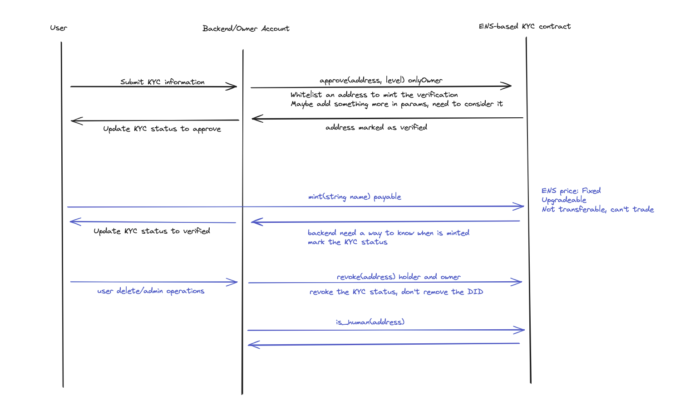

# ENS-based KYC Soulbound Token

A decentralized KYC (Know Your Customer) system based on ENS (Ethereum Name Service) using Soulbound Token.

## Overview

This project implements a KYC system where:
- Users can request KYC verification using their ENS names (.hsk) and provide a hash of their personal data for privacy.
- Whitelisted users can request KYC without fees.
- Admins can approve/revoke KYC status.
- KYC status is bound to ENS names and cannot be transferred (Soulbound).
- Multiple KYC levels supported (BASIC, ADVANCED, PREMIUM).


## Features

- **ENS Integration**
  - Custom .hsk TLD (Top Level Domain)
  - ENS name ownership verification
  - ENS resolver for KYC status

- **KYC Management**
  - Request KYC with ENS name and a hash of personal data.
  - Verify KYC data hash (e.g., country and date of birth).
  - Approve/Revoke KYC status.
  - Multiple KYC levels.
  - KYC status expiration.

- **Admin Features**
  - Multi-admin support.
  - Emergency pause/unpause.
  - Fee management.
  - Whitelist management (fee exemption).

- **Security**
  - Soulbound (non-transferable)
  - Role-based access control
  - Pausable in emergency
  - Upgradeable design

## Contract Structure

```solidity
src/
├── KycSBT.sol              // Main contract
├── KycSBTStorage.sol       // Storage layout
├── KycResolver.sol         // ENS resolver
└── interfaces/
    ├── IKycSBT.sol        // Main interface
    └── IKycResolver.sol    // Resolver interface
```

## Core Functions

### User Functions
```solidity
// Request KYC verification
function requestKyc(string calldata ensName, bytes32 _kycDataHash) external payable;

// Check if an address is KYC verified
function isHuman(address account) external view returns (bool, uint8);

// Verify if the provided KYC data matches the stored commitment for a user.
function verifyKycData(address user, uint256 countryCode, uint256 dateOfBirth, bytes32 salt)
    external
    view
    returns (bool);
```

### Admin Functions
```solidity
// Approve KYC request
function approveKyc(address user, KycLevel level) external;

// Revoke KYC status
function revokeKyc(address user) external;

// Emergency controls
function emergencyPause() external;
function emergencyUnpause() external;
```

## Integration Guide

### Backend Integration Example (Node.js + ethers.js v6)

```typescript
import { 
    ethers, 
    Contract, 
    JsonRpcProvider, 
    Wallet, 
    ContractEventPayload,
    TransactionResponse,
    TransactionReceipt 
} from 'ethers';

// KYC 状态类型
interface KycStatus {
    isValid: boolean;
    level: number;
}

// 事件监听器类型
type EventCallback = (args: ContractEventPayload) => void;

class KycService {
    private provider: JsonRpcProvider;
    private wallet: Wallet;
    private kycSBT: Contract;
    private eventListeners: Map<string, EventCallback>;

    constructor(
        rpcUrl: string, 
        contractAddress: string, 
        privateKey: string, 
        abi: any[]
    ) {
        this.provider = new JsonRpcProvider(rpcUrl);
        this.wallet = new Wallet(privateKey, this.provider);
        this.kycSBT = new Contract(contractAddress, abi, this.wallet);
        this.eventListeners = new Map();
    }

    /**
     * 用户请求 KYC
     * @param ensName ENS 名称 (例如: "alice1.hsk")
     * @param kycDataHash KYC 数据的哈希值 (例如: keccak256(abi.encodePacked(countryCode, dateOfBirth, salt)))
     * @returns 交易回执
     */
    async requestKyc(ensName: string, kycDataHash: string): Promise<TransactionReceipt> {
        try {
            const fee = await this.kycSBT.registrationFee();
            const tx = await this.kycSBT.requestKyc(ensName, kycDataHash, { value: fee });
            return await tx.wait();
        } catch (error) {
            console.error('Request KYC failed:', error);
            throw error;
        }
    }

    // ... 其他方法 ...
}

// 使用示例
async function demo() {
    const config = {
        rpcUrl: "https://ethereum-goerli.publicnode.com",
        contractAddress: "YOUR_CONTRACT_ADDRESS",
        privateKey: "YOUR_PRIVATE_KEY",
        abi: [] // 你的合约 ABI
    };

    try {
        const kycService = new KycService(
            config.rpcUrl,
            config.contractAddress,
            config.privateKey,
            config.abi
        );

        // 1. 请求 KYC
        // 假设 kycDataHash 是预先计算好的，例如 keccak256(abi.encodePacked(countryCode, dateOfBirth, salt))
        const exampleKycDataHash = "0x1234567890123456789012345678901234567890123456789012345678901234"; // 替换为实际的哈希值
        const requestTx = await kycService.requestKyc("alice1.hsk", exampleKycDataHash);
        console.log("KYC Request TX:", requestTx.hash);

        // 2. 查询状态
        const status = await kycService.checkKycStatus("USER_ADDRESS");
        console.log("KYC Status:", status);
    } catch (error) {
        console.error("Demo failed:", error);
    }
}
```

## Testing

```bash
# Run all tests
forge test

# Run specific test file
forge test --match-path test/KycSBTCore.t.sol

# Run with detailed logs
forge test -vvv
```

## Deployment


## Security Considerations

1. ENS Name Validation
   - Minimum length requirements
   - Suffix (.hsk) validation
   - Ownership verification

2. Access Control
   - Owner privileges
   - Admin management
   - Emergency controls
   - Disabled constructor (prevent direct initialization)
   - Initializable pattern for upgrades

3. Fee Management
   - Registration fee
   - Fee withdrawal
   - Balance checks

## License

MIT
